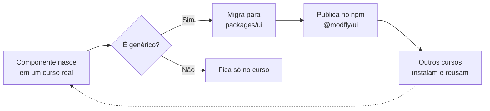
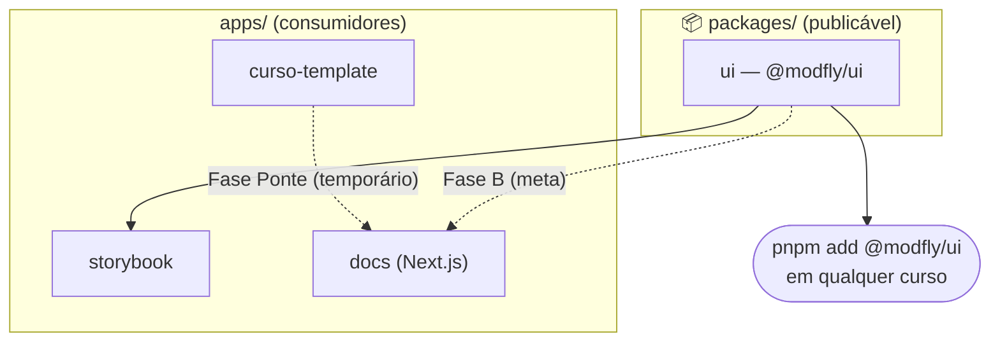

<div align="center">

<picture>
  <source media="(prefers-color-scheme: dark)" srcset="apps/docs/public/logo-dark.png">
  
</picture>

# Modfly UI

**Components built for learning.**

Uma biblioteca de componentes React feita para quem constrói cursos — não dashboards.

<br/>

[](https://react.dev)
[](https://www.typescriptlang.org)
[](https://tailwindcss.com)
[](https://turbo.build)
[](https://github.com/r0b14/Modfly.ui/actions/workflows/ci.yml)
[](LICENSE)

<br/>

[**Documentação**](https://modfly.design) · [**Storybook**](https://storybook.modfly.design) · [**npm**](https://npmjs.com/package/@modfly/ui) · [**Issues**](https://github.com/modfly-ui/ui/issues)

</div>

---

### Sumário

[O problema](#o-problema) · [O que é](#o-que-é) · [Recursos](#recursos) · [Como a lib cresce](#como-a-lib-cresce-com-o-curso) · [Stack](#stack) · [Componentes](#componentes) · [Estrutura do repositório](#estrutura-do-repositório) · [Início rápido](#início-rápido) · [Uso no seu projeto](#uso-no-seu-projeto) · [Roadmap](#roadmap) · [Contribuindo](#contribuindo) · [Autor](#autor)

---

## O problema

O mercado tem dezenas de bibliotecas de componentes. Nenhuma delas foi projetada para o contexto de **e-learning**.

Carrosséis de conteúdo, citações tipográficas, acordeões didáticos, listas de aprendizado, flashcards — esses componentes existem em todo curso EAD produzido profissionalmente. E são reescritos do zero a cada projeto.

O Modfly UI resolve isso.

---

## O que é

Uma lib **open source**, modular, construída em cima de React 18 + Tailwind CSS, com CLI de instalação por componente — inspirada no modelo do Shadcn UI, mas com foco total no ecossistema de aprendizagem digital.

```bash
npx modfly@latest add accordion
```

---

## Recursos

- 🧩 **Atomic Design** — átomos, moléculas, organismos e templates, sem misturar camadas
- ⚡ **Tree-shakeable** — build ESM + CJS + `.d.ts` via `tsup`, importe só o que usar
- 🎨 **Tailwind CSS puro** — sem CSS-in-JS pesado, fácil de sobrescrever no seu tema
- 🧭 **Zero acoplamento a router** — `Pagination`/`useModfy` recebem callbacks, funcionam com qualquer navegação
- 🇧🇷 **Documentação 100% em PT-BR** — feita para times brasileiros de e-learning
- 🎓 **Componentes pedagógicos** — carrosséis, flashcards, acordeões didáticos e citações, não widgets de dashboard

---

## Como a lib cresce com o curso

Nenhum componente nasce na biblioteca — ele nasce dentro de um curso real, e só migra se fizer sentido para outros cursos também usarem:



---

## Stack

| Camada | Tecnologia | |
|:---|:---|:---|
| Monorepo | Turborepo + pnpm | orquestração e cache de builds |
| Framework | React 18 + TypeScript | UI reativa e totalmente tipada |
| Estilo | Tailwind CSS | design system utilitário |
| Bundler | tsup | saída ESM + CJS + `.d.ts` |
| Docs | Next.js 15 (App Router) | site de documentação em PT-BR |
| Storybook | v8 + Vite | laboratório visual de componentes |

---

## Componentes

### Átomos

| Componente | Docs | npm | Story |
|:---|:---:|:---:|:---:|
| `ButtonLink` | — | — | ✅ |
| `ButtonPdfDownload` | — | — | — |
| `Tooltip` | — | — | — |
| `Postit` | — | — | — |
| `Check` | — | — | — |

### Moléculas

| Componente | Docs | npm | Story |
|:---|:---:|:---:|:---:|
| `Citation` | ✅ | — | ✅ |
| `Cards` | — | — | ✅ |
| `CardFlip` | — | — | ✅ |
| `QuoteText` | — | — | ✅ |
| `Figure` | — | — | ✅ |
| `IndentCitation` | — | — | ✅ |
| `ListModule` | — | — | ✅ |
| `MiniCards` | — | — | ✅ |
| `Embed` | — | — | ✅ |
| `ImageList` | — | — | ✅ |

### Organismos

| Componente | Docs | npm | Story |
|:---|:---:|:---:|:---:|
| `Accordion` | — | — | ✅ |
| `LearningBlock` | — | — | ✅ |
| `StarList` | — | — | — |
| `TimelineWithCards` | — | — | — |
| `HistoryTopics` | — | — | — |

### Templates

| Componente | Docs | npm | Story |
|:---|:---:|:---:|:---:|
| `Carousel` | — | — | ✅ |
| `Slider` | — | — | ✅ |
| `Pagination` | — | — | ✅ |
| `UnityBanner` | — | — | — |
| `Glossary` | — | — | — |

### `@modfly/ui-avamec` — sub-pacote

Questões interativas compatíveis com o padrão AVAMEC.

`QuestionOption` · `QuestionMultipleAnswer` · `QuestionTrueOrFalse` · `QuestionGrid` · `QuestionCorrelation` · `QuestionDragDrop` · `QuestionWritten` · `SendActivityButton`

---

## Estrutura do repositório

```
Modfly.ui/
├── apps/
│   ├── docs/              # site de documentação (Next.js 15)
│   ├── storybook/         # laboratório visual (Storybook v8)
│   └── curso-template/    # app de consumo — fonte dos componentes
├── packages/
│   ├── ui/                # core da biblioteca (@modfly/ui)
│   └── tsconfig/          # tsconfig compartilhado
├── docs/                  # documentação interna (infra, front, projeto, integrações, copyright)
├── LICENSE
├── turbo.json
└── pnpm-workspace.yaml
```

`packages/*` é o que é publicável; `apps/*` é quem consome. O `apps/docs` ainda está na "Fase Ponte" — importa direto do `curso-template` em vez de `@modfly/ui`, até a migração de cada componente ser concluída:



---

## Início rápido

```bash
# Pré-requisito: Node 18+ e pnpm
npm install -g pnpm

# Clone e instale
git clone https://github.com/modfly-ui/ui
cd ui
pnpm install

# Inicie o ambiente completo
pnpm dev
```

O comando `pnpm dev` sobe todos os apps em paralelo via Turborepo.

### Rodar um app por vez

> **Importante:** todos os comandos abaixo devem ser executados **na raiz do monorepo** (`Modfly.ui/`), nunca dentro de `packages/ui`. O `packages/ui` é uma biblioteca — rodar `pnpm dev` dentro dele apenas compila os arquivos com `tsup`, sem abrir nenhuma porta.

| App | Comando | URL | Quando usar |
|:---|:---|:---|:---|
| Storybook | `pnpm --filter storybook dev` | `localhost:6006` | Ver e testar componentes isolados |
| Docs | `pnpm --filter docs dev` | `localhost:3000` | Navegar a documentação |
| Curso Template | `pnpm --filter curso-template start` | `localhost:3000` | Ver componentes no contexto real de curso |

> Para testar um componente novo (ex: `Accordion` com `course="pce"`), o **Storybook** é o caminho mais rápido — crie uma story e veja o resultado isolado sem precisar navegar no app.

---

## Uso no seu projeto

```bash
# instala a lib
pnpm add @modfly/ui

# ou, no modelo CLI (em breve)
npx modfly@latest add citation
```

Adicione o caminho ao `content` do seu `tailwind.config`:

```js
content: [
  "./src/**/*.{js,ts,jsx,tsx}",
  "./node_modules/@modfly/ui/dist/**/*.js",
]
```

```tsx
import { Citation, Accordion } from '@modfly/ui'

export default function Aula() {
  return (
    <Citation
      author="Paulo Freire"
      text="Ensinar não é transferir conhecimento, mas criar possibilidades para a sua produção."
    />
  )
}
```

---

## Roadmap

```
✅ Fase 0 — Monorepo + site de docs
🔄 Fase 1 — Migração dos componentes para packages/ui
🔄 Fase 2 — Deploy (Vercel) + domínio + npm
⏳ Fase 3 — @modfly/ui-avamec (questões interativas)
⏳ Fase 4 — CLI + polimento + Changesets
```

---

## Contribuindo

Toda contribuição é bem-vinda — do relatório de bug à nova história no Storybook. Antes de abrir um PR, leia o [padrão de documentação de componentes](docs/front/padrao-documentacao-componentes.md) e o guia de [assets PNG/SVG](docs/front/guia-assets-png-svg.md).

```
feat: novo componente
fix: correção de bug
docs: mudança em documentação
style: formatação / visual
refactor: refatoração
perf: melhoria de performance
```

Seguimos o padrão **[Conventional Commits](https://www.conventionalcommits.org/pt-br)**.

---

## Autor

<table>
  <tr>
    <td width="120" align="center" valign="top">
      <a href="https://github.com/r0b14">
        <br/>
        <sub><b>Robson Thiago</b></sub>
      </a>
    </td>
    <td valign="top">
      <strong>Criador & mantenedor principal</strong><br/>
      <br/>
      Designer de sistemas que escreve TypeScript. Começou a construir essa lib porque nenhuma outra entendia o que é produzir um curso online de verdade — com flashcards, carrosséis pedagógicos e componentes que respeitam o estudante.<br/>
      <br/>
      <a href="https://twitter.com/_r0b14">Twitter</a> ·
      <a href="https://linkedin.com/in/robson-thiago">LinkedIn</a> ·
      <a href="https://github.com/r0b14">GitHub</a>
    </td>
  </tr>
</table>

> Este projeto nasceu de pesquisas incubadas no **[Vlab UFPE](https://vlab.ufpe.br)** e hoje é desenvolvido de forma independente.

---

<div align="center">
  <sub>MIT License · feito com foco no estudante</sub>
</div>
