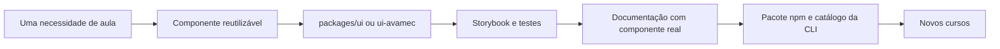
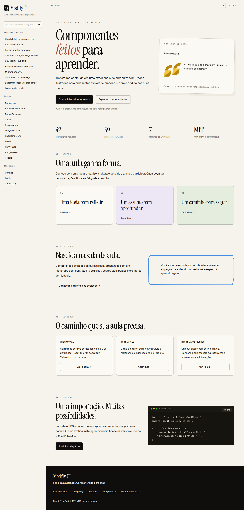

<div align="center">


# Modfly UI

**Componentes feitos para aprender.**

🧩 Explique. 🎴 Explore. ✍️ Pratique. 💡 Aprenda.

Uma biblioteca React e TypeScript para transformar conteúdo em experiências de aprendizagem.

**42 componentes · 7 formatos de atividade · 51 entradas na CLI · 102 páginas PT/EN**

[Começar](#primeira-aula) · [Catálogo](#componentes) · [Documentação interna](docs/README.md) · [Changelog](CHANGELOG.md) · [MIT](LICENSE)

</div>

> **v1.1.0 em preparação.** Implementação e validação automatizada disponíveis no [PR #5](https://github.com/r0b14/Modfly.ui/pull/5). Publicação npm, homologação AVAMEC real e acesso público aos domínios ainda dependem das etapas de lançamento. Veja [evidências](#qualidade) e [publicação](#publicacao).

| Seu próximo passo | Comece aqui |
| --- | --- |
| Montar uma aula | [Instalação e primeiro exemplo](#primeira-aula) |
| Adaptar o código de um componente | [CLI e arquivos editáveis](#cli) |
| Criar uma atividade | [Questões e persistência](#avamec) |
| Trabalhar no site ou na biblioteca | [Ambiente de desenvolvimento](#desenvolvimento) |
| Preparar o lançamento | [Estado da release e publicação](#publicacao) |

## Índice

1. [O que a biblioteca faz](#visao-geral)
2. [Origem e evolução](#origem)
3. [Sua primeira aula](#primeira-aula)
4. [Catálogo de componentes](#componentes)
5. [Questões e AVAMEC](#avamec)
6. [Código editável com a CLI](#cli)
7. [Temas, assets e layout](#design)
8. [Site e documentação bilíngue](#site)
9. [Arquitetura e decisões técnicas](#arquitetura)
10. [Ambiente e comandos](#desenvolvimento)
11. [Qualidade e evidências](#qualidade)
12. [Publicação e recuperação](#publicacao)
13. [Problemas frequentes](#diagnostico)
14. [Mapa da documentação](#documentacao)
15. [Contribuição, autoria e licença](#contribuir)

<a id="visao-geral"></a>

## O que a biblioteca faz

Pense em uma aula como uma sequência de descobertas: um banner apresenta o assunto, uma citação provoca reflexão, um acordeão aprofunda a explicação e uma atividade ajuda o estudante a praticar.

A Modfly reúne essas peças para que cada curso não precise reconstruí-las. O conteúdo continua sendo seu: textos, imagens, navegação, regras do curso e conexão com a plataforma entram por propriedades e adaptadores.

| Quero… | Uso… |
| --- | --- |
| Montar a interface de uma aula | `@modfly/ui` |
| Criar questões e registrar atividades | `@modfly/ui-avamec` |
| Editar os componentes dentro do meu projeto | CLI `modfly` |
| Explorar apresentações e comportamentos | Storybook |
| Entender uma API e copiar um exemplo | Site de documentação |

Os três pacotes têm responsabilidades separadas: [core](packages/ui/README.md), [atividades](packages/ui-avamec/README.md) e [CLI](packages/cli/README.md). A aplicação fornece conteúdo e infraestrutura; a biblioteca oferece apresentação e contratos de interação.

<a id="origem"></a>

## Origem e evolução

O projeto nasceu do trabalho com cursos de e-learning e de pesquisas incubadas no **Vlab UFPE**, conforme o histórico documentado do repositório. Hoje é desenvolvido de forma independente por Robson Thiago.

Os componentes começaram dentro de cursos reais. A biblioteca extrai as partes reutilizáveis, separa conteúdo de apresentação e oferece uma API comum. O modelo de código editável da CLI tem inspiração em projetos como Shadcn UI e Pittaya UI; isso não significa que a Modfly seja uma distribuição desses projetos.



<a id="primeira-aula"></a>

## Sua primeira aula

Os comandos abaixo descrevem o uso da versão **após sua publicação**. Para experimentar antes, siga o [ambiente local](#desenvolvimento).

```bash
pnpm add @modfly/ui@1.1.0
```

Importe o CSS uma vez no entrypoint global: `src/main.tsx` no Vite ou `app/layout.tsx` no Next.js.

```tsx
import '@modfly/ui/styles.css';
```

Crie uma aula:

```tsx
'use client';

import { Accordion, Citation } from '@modfly/ui';

export default function Aula() {
  return (
    <main>
      <h1>Aprender fazendo</h1>
      <Citation
        title="Uma ideia para começar"
        text="Aprender combina explicação, prática e reflexão."
      />
      <Accordion title="Como colocar em prática?" bgColor={1}>
        <p>Escolha uma ideia da aula e explique-a com suas palavras.</p>
      </Accordion>
    </main>
  );
}
```

**Não é necessário instalar Tailwind para consumir o CSS compilado.** React e React DOM são dependências do projeto consumidor. A compatibilidade declarada cobre React 18.2 e React 19; a matriz de validação da release verifica essas duas linhas.

| Compatibilidade | Requisito |
| --- | --- |
| Aplicação consumidora | React e React DOM `^18.2.0` ou `^19.0.0` |
| Distribuição | ESM, CommonJS, declarações TypeScript e CSS |
| CLI e monorepo | Node `>=22.14.0`; referência de desenvolvimento: [`.nvmrc`](.nvmrc) |
| Workspace | pnpm `9.0.0`, fixado no [manifesto](package.json) |

No Next.js, mantenha estado e callbacks em uma fronteira `'use client'`. No Vite, use o entrypoint normal da aplicação. O import do CSS continua global nos dois casos.

<a id="componentes"></a>

## Catálogo de componentes

A organização segue Atomic Design: peças pequenas formam conjuntos que, por sua vez, ajudam a compor uma aula. As categorias organizam o código; os imports públicos saem de `@modfly/ui`.

<details>
<summary><strong>Explorar os 39 grupos e suas exportações</strong></summary>

<!-- component-inventory:start -->
| Camada | Componentes |
| --- | --- |
| Átomos | [ButtonLink](https://modfly.design/pt/docs/components/buttonlink) · [ButtonPdfDownload](https://modfly.design/pt/docs/components/buttonpdfdownload) · [ButtonReference](https://modfly.design/pt/docs/components/buttonreference) · [Check](https://modfly.design/pt/docs/components/check) · [Exclamation](https://modfly.design/pt/docs/components/exclamation) · [ImageFallback](https://modfly.design/pt/docs/components/imagefallback) · [PageRenderError](https://modfly.design/pt/docs/components/pagerendererror) · [Postit](https://modfly.design/pt/docs/components/postit) · [RangeBlue](https://modfly.design/pt/docs/components/rangeblue) · [RangeGreen](https://modfly.design/pt/docs/components/rangegreen) · [Tooltip](https://modfly.design/pt/docs/components/tooltip) |
| Moléculas | [CardFlip](https://modfly.design/pt/docs/components/cardflip) · [Cards](https://modfly.design/pt/docs/components/cards) · [CaseStudy](https://modfly.design/pt/docs/components/casestudy) · [Citation](https://modfly.design/pt/docs/components/citation) · [Embed](https://modfly.design/pt/docs/components/embed) · [Figure](https://modfly.design/pt/docs/components/figure) · [ImageList](https://modfly.design/pt/docs/components/imagelist) · [IndentCitation](https://modfly.design/pt/docs/components/indentcitation) · [ListModule](https://modfly.design/pt/docs/components/listmodule) · [MiniCards](https://modfly.design/pt/docs/components/minicards) · [QuestionReflect](https://modfly.design/pt/docs/components/questionreflect) · [QuoteText](https://modfly.design/pt/docs/components/quotetext) · [Quotes](https://modfly.design/pt/docs/components/quotes) · [ReferenceModal](https://modfly.design/pt/docs/components/referencemodal) |
| Organismos | [Accordion](https://modfly.design/pt/docs/components/accordion) · [HistoryTopics](https://modfly.design/pt/docs/components/historytopics) · [LearningBlock](https://modfly.design/pt/docs/components/learningblock) · [QuestionOptionHeader](https://modfly.design/pt/docs/components/questionoptionheader) · [StarList](https://modfly.design/pt/docs/components/starlist) · [TimelineWithCards](https://modfly.design/pt/docs/components/timelinewithcards) |
| Templates | [Carousel](https://modfly.design/pt/docs/components/carousel) · [Container](https://modfly.design/pt/docs/components/container) · [Glossary](https://modfly.design/pt/docs/components/glossary) · [Minibanner](https://modfly.design/pt/docs/components/minibanner) · [Pagination](https://modfly.design/pt/docs/components/pagination) · [Slider](https://modfly.design/pt/docs/components/slider) · [TextWithImageBox](https://modfly.design/pt/docs/components/textwithimagebox) · [UnityBanner](https://modfly.design/pt/docs/components/unitybanner) |
<!-- component-inventory:end -->

</details>

Cada página apresenta contexto, demonstração interativa, tipos das propriedades, exemplo e variantes. A API é extraída dos tipos TypeScript; as demonstrações reutilizam as stories e importam o pacote real.

O inventário acima é atualizado por `pnpm docs:generate`. O grupo `IndentCitation` reúne quatro exportações, totalizando **42 componentes públicos**. Os links apontam para os endereços de produção planejados; enquanto os domínios não estiverem disponíveis, abra as mesmas rotas no ambiente local.

<a id="avamec"></a>

## Questões e AVAMEC

```bash
pnpm add @modfly/ui-avamec@1.1.0
```

```tsx
'use client';

import { useMemo } from 'react';
import {
  ActivityQuestions, QuestionsProvider, createMemoryAdapter,
} from '@modfly/ui-avamec';
import type { ActivityDefinition } from '@modfly/ui-avamec';
import '@modfly/ui-avamec/styles.css';

const activity: ActivityDefinition = {
  module: 1,
  slide: 1,
  maxAttempts: 3,
  questions: [{
    id: '1',
    type: 'option',
    prompt: 'O que ajuda a consolidar o aprendizado?',
    options: [
      { id: 'a', label: 'Praticar e receber feedback' },
      { id: 'b', label: 'Ignorar dúvidas' },
    ],
    correctAnswer: 'a',
  }],
};

export function Atividade() {
  const adapter = useMemo(() => createMemoryAdapter(), []);
  return (
    <QuestionsProvider activity={activity} adapter={adapter}>
      <ActivityQuestions />
    </QuestionsProvider>
  );
}
```

O exemplo usa memória e reinicia ao recarregar. Para persistência local, use `createLocalAdapter(storage, namespace)` com um namespace por curso e estudante. Para a plataforma, injete um `AvamecBridge` em `createAvamecAdapter(bridge)`.

| Formato | Identificador em `ActivityDefinition` |
| --- | --- |
| Alternativa única | `option` |
| Múltiplas respostas | `multiple` |
| Verdadeiro ou falso por linha | `true-false` |
| Classificação em grade | `grid` |
| Correlação | `correlation` |
| Arrastar ou selecionar pelo teclado | `drag-drop` |
| Resposta textual aceita | `written` |

Você pode usar `ActivityQuestions` ou compor os componentes individualmente dentro do provider. A resposta escrita usa comparação textual com respostas aceitas; não realiza avaliação semântica.

O envio separa **resultado binário** de **respostas detalhadas**. Erros remotos são exibidos. Um envio sem confirmação bloqueia novas tentativas até reconciliação; o contrato existente não oferece idempotência para repetir uma requisição com segurança. A implementação não migra automaticamente o estado dos cursos antigos.

Veja [integração, contratos e migração](docs/integracoes/avamec-v1.1.md). Homologação real é uma condição de lançamento, não uma consequência dos testes com simulador.

<a id="cli"></a>

## Código editável com a CLI

```bash
npx modfly@1.1.0 init
npx modfly@1.1.0 list
npx modfly@1.1.0 add citation accordion
npx modfly@1.1.0 add question-option
```

O `init` cria `modfly.json`. O `add` copia o componente e suas dependências de código para `src/components/modfly`, ou `components/modfly` se o projeto não tiver `src`. Depois:

1. Importe o `styles.css` do diretório gerado uma vez.
2. Importe os componentes pelos caminhos mostrados no terminal.
3. Edite os arquivos para adaptar sua aula.

| Opção | Comportamento |
| --- | --- |
| `--dry-run` | Mostra o que será copiado sem escrever arquivos |
| `--no-install` | Copia os arquivos e informa dependências para instalação manual |
| `--force` | Permite substituir arquivos locais modificados |
| `--cwd pasta` | Executa em outro projeto |

A versão da CLI deve corresponder à versão de `modfly.json`. Sem `--force`, conflitos interrompem a cópia antes da primeira alteração. Assets são convertidos em módulos portáveis; o consumidor não precisa configurar SVGR.

O catálogo possui **51 entradas**, incluindo componentes core, exportações da família `IndentCitation` e componentes AVAMEC. Consulte os nomes disponíveis com `list`; o formato do catálogo não exige que o nome da pasta seja usado como import.

```json
{
  "version": "1.1.0",
  "directory": "src/components/modfly"
}
```

Esse é um exemplo de `modfly.json`. Após copiar um componente, suas alterações ficam no seu projeto; atualizar o pacote npm não modifica esses arquivos automaticamente.

<a id="design"></a>

## Temas, assets e layout

🎨 **Componentes da aula:** preservam as ilustrações e variantes dos cursos de origem. Cores, conteúdos e dimensões são configuráveis conforme a API de cada componente. Não existe um provider universal de tema nesta versão.

📖 **Site de documentação:** usa navegação lateral, coluna de leitura e sumário contextual em telas amplas. No celular, a navegação é recolhida. A identidade combina cores de destaque, tipografia editorial e blocos de código copiáveis.

🖼️ **Assets:** SVGs decorativos podem ser componentes React; SVGs usados em `img` são URLs explícitas. Imagens do pacote ficam incorporadas na distribuição. Fotos e conteúdo específico de cursos entram por props.

O CSS distribuído contém utilitários Tailwind sem o reset global Preflight. Alguns componentes, como Accordion, também usam Emotion para estilos estruturais.

Ao copiar código pela CLI, novas classes Tailwind criadas por você precisam ser compiladas no seu projeto. Conteúdo HTML passado a props deve ser confiável e sanitizado pela aplicação; prefira ReactNode quando disponível.

<a id="site"></a>

## Site e documentação bilíngue

O site tem **102 páginas de conteúdo**: página inicial, catálogo, 39 referências e dez guias, em português e inglês. O seletor de idioma preserva a página e a seção aberta. As demonstrações reutilizam o conteúdo original dos cursos em português, identificado no HTML; nomes de componentes e propriedades permanecem iguais no código.

| Ambiente | Português | Inglês |
| --- | --- | --- |
| Documentação local | `http://localhost:3000/pt` | `http://localhost:3000/en` |
| Domínio planejado | [modfly.design/pt](https://modfly.design/pt) | [modfly.design/en](https://modfly.design/en) |
| Storybook local | `http://localhost:6006/?path=/docs/welcome-portugues--docs` | `http://localhost:6006/?path=/docs/welcome-english--docs` |
| Domínio do laboratório | [storybook.modfly.design](https://storybook.modfly.design) | Mesmo domínio, apresentação em inglês |

O preview do PR exige login da equipe Vercel. Os domínios próprios ainda precisam da configuração descrita no [relatório do site](docs/projeto/entrega-site-publico.md).

A experiência inclui busca com `Ctrl/Cmd + K`, catálogo filtrável, menu móvel com controle de foco, índice por teclado, exemplos copiáveis e páginas de erro. URLs antigas `/docs/*` redirecionam para `/pt/docs/*`; canonical, alternates e sitemap identificam as versões de cada página. Previews recebem `noindex`.

**Como manter:** edite guias, descrições e orientações em [`apps/docs/content`](apps/docs/content). Execute `pnpm docs:generate` para atualizar tipos, stories, catálogo e inventário. Os textos editoriais ficam separados dos arquivos gerados. As rotas compartilhadas renderizam os dois idiomas sem duplicar páginas.

<details>
<summary><strong>Veja a interface do site</strong></summary>

Captura da implementação local, em desktop. Ela ilustra o layout entregue; o estado da publicação é registrado separadamente nos relatórios.



</details>

Consulte o [guia de manutenção do site bilíngue](docs/front/site-publico-bilingue.md) para conteúdo, rotas, metadados, publicação e reversão.

<a id="arquitetura"></a>

## Arquitetura e decisões técnicas

| Escolha | Por quê | Consequência prática |
| --- | --- | --- |
| TypeScript + TSX | Expressar contratos e compor UI React | Props tipadas e declarações `.d.ts` no pacote |
| React | Composição e atualização de estado | O consumidor fornece React; a lib não inclui outra cópia |
| Tailwind 3 + Emotion | Preservar utilitários e estilos dos componentes existentes | CSS pronto para uso, sem reescrita visual durante a release |
| pnpm + Turborepo | Organizar dependências e ordem dos builds | Pacotes são construídos antes dos apps consumidores |
| tsup | Distribuir módulos e tipos | Saídas ESM e CommonJS com assets resolvidos |
| Next.js 16 | Publicar documentação navegável | Páginas usam a biblioteca real e fronteiras de cliente |
| Storybook 8 + Vite | Explorar componentes isoladamente | Stories servem de base para demos e verificações |
| Vitest + Testing Library + Playwright | Verificar contratos, UI e navegador | Falhas reproduzíveis antes da publicação |
| JavaScript ESM na CLI | Executar diretamente no Node | Sem runtime adicional para os comandos |
| Adaptadores AVAMEC | Separar UI da infraestrutura do curso | Simulação local e integração remota explícitas |

As responsabilidades seguem um fluxo: **fontes dos pacotes → build → aplicações consumidoras**. Stories e testes verificam as implementações reais. A CLI transforma o mesmo código em arquivos editáveis; as páginas de referência extraem os contratos públicos sem recriar componentes de demonstração.

<a id="desenvolvimento"></a>

## Ambiente e comandos

Enquanto o [PR #5](https://github.com/r0b14/Modfly.ui/pull/5) não estiver integrado em `main`, use a branch de preparação abaixo para reproduzir esta documentação.

**Pré-requisitos do monorepo:** Node 22.14+ e pnpm 9.0.0. A versão de referência está em `.nvmrc`.

```bash
git clone --branch codex/modfly-v1.1-release https://github.com/r0b14/Modfly.ui.git
cd Modfly.ui
nvm use # se você usa nvm
corepack enable
pnpm install --frozen-lockfile
pnpm build
pnpm dev
```

| Ambiente | Comando na raiz | Endereço |
| --- | --- | --- |
| Documentação | `pnpm --filter docs dev` | http://localhost:3000 |
| Storybook | `pnpm --filter storybook dev` | http://localhost:6006 |
| Aula de exemplo | `pnpm --filter curso-template dev` | http://localhost:3001 |
| CLI local | `node packages/cli/src/cli.mjs --help` | Terminal |

```text
apps/
  docs/             site e documentação pública em /pt e /en
  storybook/        laboratório de componentes
  curso-template/   aula que consome os pacotes
packages/
  ui/               componentes e estilos
  ui-avamec/        questões, estado e adaptadores
  cli/              comandos e catálogo de código
  tsconfig/         configurações compartilhadas
  @legado/          referência histórica privada
scripts/            geração de catálogo e distribuição
tests/              verificações automatizadas
docs/               decisões, contratos e evidências
```

`packages/@legado` e os componentes antigos do curso-template são referências de migração; não são a fonte do pacote publicado. Logos, layout institucional e infográficos de cursos continuam específicos do curso.

### Experimentar a distribuição antes do npm

Após `pnpm build`, gere os arquivos instaláveis na raiz do workspace:

```bash
mkdir -p artifacts
pnpm --dir packages/ui pack --pack-destination ../../artifacts
pnpm --dir packages/ui-avamec pack --pack-destination ../../artifacts
pnpm --dir packages/cli pack --pack-destination ../../artifacts
```

Instale o `.tgz` desejado em um projeto React de teste, usando seu caminho local. O empacotamento não publica versões no registro. Para verificar automaticamente consumidores isolados, execute `pnpm test:packages`.

<a id="qualidade"></a>

## Qualidade e evidências

| Comando na raiz | O que verifica |
| --- | --- |
| `pnpm docs:generate` | Atualiza catálogo, exemplos, tipos e inventário do README |
| `pnpm lint` | Regras estáticas do código |
| `pnpm typecheck` | Contratos TypeScript de pacotes, apps e stories |
| `pnpm build` | Distribuições dos três pacotes e builds dos três apps |
| `pnpm test` | Componentes, contratos AVAMEC, CLI e exemplos compiláveis |
| `pnpm check` | Executa lint, tipos, build e testes, nessa ordem |
| `pnpm test:e2e` | Navegador, site bilíngue, variantes e Storybook |
| `pnpm test:packages` | Instalação de tarballs em consumidores React 18 e 19 isolados |

Prepare o navegador uma vez e execute a verificação completa:

```bash
pnpm exec playwright install --with-deps chromium
pnpm docs:generate
pnpm check
pnpm test:e2e
pnpm test:packages
```

**Última validação registrada — 9 de setembro de 2026:** 197 testes, 62 cenários de navegador, seis builds e CI aprovados. A suíte percorre as 102 páginas nos dois idiomas em larguras de 375, 768 e 1440 pixels. Inclui navegação, teclado, mídia das fixtures, metadados e auditoria de acessibilidade; players externos são simulados e a integração AVAMEC real exige homologação própria.

- [Execução aprovada no GitHub Actions](https://github.com/r0b14/Modfly.ui/actions/runs/34361579552)
- [Evidências da biblioteca e condições de lançamento](docs/projeto/entrega-v1.1.md)
- [Evidências do site e capturas](docs/projeto/entrega-site-publico.md)

Relatórios de navegador ficam em `playwright-report/`; tarballs e capturas de trabalho, em `artifacts/`. Esses diretórios são gerados e não são versionados. A captura exibida neste README é uma cópia selecionada em `docs/assets/`.

<a id="publicacao"></a>

## Publicação e recuperação

| Frente | Estado registrado | Condição para concluir |
| --- | --- | --- |
| Código e validação | Implementados; CI aprovado | Revisar e integrar o PR |
| Pacotes npm | Versão 1.1.0 preparada, sem publicação confirmada | Autenticação npm e execução da release |
| AVAMEC real | Contratos e simuladores verificados | Acesso à homologação e evidência da integração |
| Site público | Build e preview disponíveis; preview protegido | Acesso à Vercel e configuração de domínio/DNS |
| Storybook público | Build e navegação verificados localmente | Vincular projeto, domínio e acesso público |

Changesets mantém as versões dos três pacotes alinhadas. O workflow [Release](.github/workflows/release.yml) permite os canais `next` e `latest`: candidatas recebem sufixo `-rc.<execução>`; o canal estável exige uma URL HTTPS de evidência de homologação. O workflow valida a presença dessa URL; a equipe precisa revisar o conteúdo da evidência.

A sequência é: validar o commit, publicar candidata, homologar, publicar a versão estável e conferir instalação pelo registro e acesso aos sites sem login. O workflow usa o ambiente `npm-release` e o secret `NPM_TOKEN`; as configurações dos projetos Vercel e do DNS são externas ao repositório.

Se uma publicação parar entre pacotes, consulte as versões já publicadas antes de retomar. Se houver regressão, restaure o deployment anterior e, quando disponível, o dist-tag da versão npm anterior; entregue a correção em uma nova versão.

Procedimentos completos: [release dos pacotes](docs/projeto/entrega-v1.1.md#procedimento-de-publicação) e [publicação e reversão do site](docs/front/site-publico-bilingue.md#publicar-e-reverter).

<a id="diagnostico"></a>

## Problemas frequentes

| Situação | Primeiro diagnóstico |
| --- | --- |
| O pacote 1.1.0 não aparece no npm | Confira o estado da publicação; antes dela, use a branch de preparação ou tarballs locais |
| O componente aparece sem estilo | Verifique o import global de `styles.css` e a ordem das folhas de estilo |
| Um callback falha no Next.js | Mantenha estado e callbacks em uma fronteira `'use client'` |
| A CLI encontrou conflito | Revise os arquivos locais com `--dry-run`; use `--force` apenas para substituir suas edições |
| A versão de `modfly.json` diverge | Use a CLI correspondente; compare APIs e arquivos antes de migrar |
| Uma atividade ficou sem confirmação | Confira o registro na plataforma antes de reconciliar; não force reenvio |
| O browser de teste não inicia | Instale as dependências do Chromium; há notas específicas do ambiente no relatório da entrega |
| O site pede login ou o domínio não resolve | Confira proteção do deployment, associação do domínio e registros DNS |

Para reportar uma falha, inclua versão, ambiente, passos mínimos e comportamento esperado nas [issues](https://github.com/r0b14/Modfly.ui/issues).

<a id="documentacao"></a>

## Mapa da documentação

| Quero entender… | Documento |
| --- | --- |
| Uso e distribuição do core | [README de @modfly/ui](packages/ui/README.md) |
| Atividades e adaptadores | [README de @modfly/ui-avamec](packages/ui-avamec/README.md) |
| Instalação de código editável | [README da CLI](packages/cli/README.md) |
| Mudanças da versão | [Changelog](CHANGELOG.md) |
| Toda a documentação técnica | [Índice interno](docs/README.md) |
| Fonte de verdade e fluxo dos componentes | [Arquitetura e fluxo](docs/projeto/fluxo-saudavel-componentes.md) |
| Criar uma página de referência | [Padrão de documentação](docs/front/padrao-documentacao-componentes.md) |
| Traduzir e manter o site | [Site público bilíngue](docs/front/site-publico-bilingue.md) |
| Migrar um curso existente | [Migração para v1.1](docs/projeto/migracao-v1.1.md) |
| Integrar o AVAMEC | [Contrato e homologação](docs/integracoes/avamec-v1.1.md) |
| Conferir a entrega | [Biblioteca](docs/projeto/entrega-v1.1.md) · [Site](docs/projeto/entrega-site-publico.md) |

Os documentos históricos ficam identificados no índice interno. Para implementar ou publicar a v1.1, comece pelos guias atuais e pelos contratos exportados.

<a id="contribuir"></a>

## Contribuição, autoria e licença

Uma contribuição deve contar uma história verificável: qual necessidade da aula ela resolve, qual comportamento entrega e como foi validada.

1. Implemente ou ajuste a API tipada no pacote responsável.
2. Inclua stories com exemplos reais e testes para comportamentos relevantes.
3. Atualize os textos editoriais em português e inglês quando houver mudança na documentação pública.
4. Rode a geração do catálogo e as verificações adequadas à alteração.
5. Registre mudanças de pacote com Changesets e abra um PR com contexto e evidências.

Use commits convencionais, como `feat`, `fix`, `docs`, `refactor` e `test`. Preserve o conteúdo específico do curso fora da API genérica da biblioteca.

**Criador e mantenedor:** [Robson Thiago](https://github.com/r0b14). Origem em pesquisas incubadas no Vlab UFPE, conforme o histórico do projeto, com desenvolvimento independente.

Distribuído sob a [licença MIT](LICENSE). Preserve a atribuição ao redistribuir o código. Veja a [nota de autoria e licenciamento](docs/copyright/licenca-mit.md).

[↑ Voltar ao índice](#índice)
