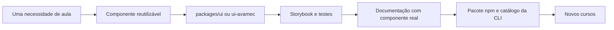

<div align="center">
<picture>
  <source media="(prefers-color-scheme: dark)" srcset="apps/docs/public/logo-dark.png">
  
</picture>

# Modfly UI

**Components built for learning.**

🧩 Explique. 🎴 Explore. ✍️ Pratique. 💡 Aprenda.

Componentes React e TypeScript para transformar conteúdo em experiências de aprendizagem.

[Documentação](https://modfly.design) · [Storybook](https://storybook.modfly.design) · [Código e issues](https://github.com/r0b14/Modfly.ui) · [Licença MIT](LICENSE)

</div>

> **Versão em preparação: 1.1.0.** O escopo inclui biblioteca, questões AVAMEC e CLI. A versão só será considerada lançada após validação, homologação e publicação. Consulte as evidências e pendências no [relatório da entrega](docs/projeto/entrega-v1.1.md).

## Encontre seu caminho

1. [O que a biblioteca faz](#o-que-a-biblioteca-faz)
2. [De onde veio](#de-onde-veio)
3. [Sua primeira aula](#sua-primeira-aula)
4. [Escolha seus componentes](#escolha-seus-componentes)
5. [Questões e AVAMEC](#questões-e-avamec)
6. [Código editável com a CLI](#código-editável-com-a-cli)
7. [Temas, assets e layout](#temas-assets-e-layout)
8. [Linguagens e decisões técnicas](#linguagens-e-decisões-técnicas)
9. [Como trabalhar no projeto](#como-trabalhar-no-projeto)
10. [Qualidade e publicação](#qualidade-e-publicação)
11. [Contribuir e conhecer a origem](#contribuir-e-conhecer-a-origem)

## O que a biblioteca faz

Pense em uma aula como uma sequência de descobertas: um banner apresenta o assunto, uma citação provoca reflexão, um acordeão aprofunda a explicação e uma atividade ajuda o estudante a praticar.

A Modfly reúne essas peças para que cada curso não precise reconstruí-las. O conteúdo continua sendo seu: textos, imagens, navegação, regras do curso e conexão com a plataforma entram por propriedades e adaptadores.

| Quero… | Uso… |
| --- | --- |
| Montar a interface de uma aula | `@modfly/ui` |
| Criar questões e registrar atividades | `@modfly/ui-avamec` |
| Editar os componentes dentro do meu projeto | CLI `modfly` |
| Explorar apresentações e comportamentos | Storybook |
| Entender uma API e copiar um exemplo | Site de documentação |

## De onde veio

O projeto nasceu do trabalho com cursos de e-learning e de pesquisas incubadas no **Vlab UFPE**, conforme o histórico documentado do repositório. Hoje é desenvolvido de forma independente por Robson Thiago.

Os componentes começaram dentro de cursos reais. A biblioteca extrai as partes reutilizáveis, separa conteúdo de apresentação e oferece uma API comum. O modelo de código editável da CLI tem inspiração em projetos como Shadcn UI e Pittaya UI; isso não significa que a Modfly seja uma distribuição desses projetos.



## Sua primeira aula

Os comandos abaixo descrevem o uso da versão **após sua publicação**. Para experimentar antes, siga o [ambiente local](#como-trabalhar-no-projeto).

```bash
pnpm add @modfly/ui@1.1.0
```

Importe o CSS uma vez no entrypoint global: `src/main.tsx` no Vite ou `app/layout.tsx` no Next.js.

```tsx
import '@modfly/ui/styles.css';
```

Crie uma aula:

```tsx
'use client';

import { Accordion, Citation } from '@modfly/ui';

export default function Aula() {
  return (
    <main>
      <h1>Aprender fazendo</h1>
      <Citation
        title="Uma ideia para começar"
        text="Aprender combina explicação, prática e reflexão."
      />
      <Accordion title="Como colocar em prática?" bgColor={1}>
        <p>Escolha uma ideia da aula e explique-a com suas palavras.</p>
      </Accordion>
    </main>
  );
}
```

**Não é necessário instalar Tailwind para consumir o CSS compilado.** React e React DOM são dependências do projeto consumidor. A compatibilidade declarada cobre React 18.2 e React 19; a matriz de validação da release verifica essas duas linhas.

## Escolha seus componentes

A organização segue Atomic Design: peças pequenas formam conjuntos que, por sua vez, ajudam a compor uma aula. As categorias organizam o código; os imports públicos saem de `@modfly/ui`.

<!-- component-inventory:start -->
| Camada | Componentes |
| --- | --- |
| Átomos | [ButtonLink](https://modfly.design/docs/components/buttonlink) · [ButtonPdfDownload](https://modfly.design/docs/components/buttonpdfdownload) · [ButtonReference](https://modfly.design/docs/components/buttonreference) · [Check](https://modfly.design/docs/components/check) · [Exclamation](https://modfly.design/docs/components/exclamation) · [ImageFallback](https://modfly.design/docs/components/imagefallback) · [PageRenderError](https://modfly.design/docs/components/pagerendererror) · [Postit](https://modfly.design/docs/components/postit) · [RangeBlue](https://modfly.design/docs/components/rangeblue) · [RangeGreen](https://modfly.design/docs/components/rangegreen) · [Tooltip](https://modfly.design/docs/components/tooltip) |
| Moléculas | [CardFlip](https://modfly.design/docs/components/cardflip) · [Cards](https://modfly.design/docs/components/cards) · [CaseStudy](https://modfly.design/docs/components/casestudy) · [Citation](https://modfly.design/docs/components/citation) · [Embed](https://modfly.design/docs/components/embed) · [Figure](https://modfly.design/docs/components/figure) · [ImageList](https://modfly.design/docs/components/imagelist) · [IndentCitation](https://modfly.design/docs/components/indentcitation) · [ListModule](https://modfly.design/docs/components/listmodule) · [MiniCards](https://modfly.design/docs/components/minicards) · [QuestionReflect](https://modfly.design/docs/components/questionreflect) · [QuoteText](https://modfly.design/docs/components/quotetext) · [Quotes](https://modfly.design/docs/components/quotes) · [ReferenceModal](https://modfly.design/docs/components/referencemodal) |
| Organismos | [Accordion](https://modfly.design/docs/components/accordion) · [HistoryTopics](https://modfly.design/docs/components/historytopics) · [LearningBlock](https://modfly.design/docs/components/learningblock) · [QuestionOptionHeader](https://modfly.design/docs/components/questionoptionheader) · [StarList](https://modfly.design/docs/components/starlist) · [TimelineWithCards](https://modfly.design/docs/components/timelinewithcards) |
| Templates | [Carousel](https://modfly.design/docs/components/carousel) · [Container](https://modfly.design/docs/components/container) · [Glossary](https://modfly.design/docs/components/glossary) · [Minibanner](https://modfly.design/docs/components/minibanner) · [Pagination](https://modfly.design/docs/components/pagination) · [Slider](https://modfly.design/docs/components/slider) · [TextWithImageBox](https://modfly.design/docs/components/textwithimagebox) · [UnityBanner](https://modfly.design/docs/components/unitybanner) |
<!-- component-inventory:end -->

Cada página apresenta contexto, demonstração interativa, tipos das propriedades, exemplo e variantes. A API é extraída dos tipos TypeScript; as demonstrações reutilizam as stories e importam o pacote real.

## Questões e AVAMEC

```bash
pnpm add @modfly/ui-avamec@1.1.0
```

```tsx
'use client';

import { useMemo } from 'react';
import {
  ActivityQuestions, QuestionsProvider, createMemoryAdapter,
} from '@modfly/ui-avamec';
import type { ActivityDefinition } from '@modfly/ui-avamec';
import '@modfly/ui-avamec/styles.css';

const activity: ActivityDefinition = {
  module: 1,
  slide: 1,
  maxAttempts: 3,
  questions: [{
    id: '1',
    type: 'option',
    prompt: 'O que ajuda a consolidar o aprendizado?',
    options: [
      { id: 'a', label: 'Praticar e receber feedback' },
      { id: 'b', label: 'Ignorar dúvidas' },
    ],
    correctAnswer: 'a',
  }],
};

export function Atividade() {
  const adapter = useMemo(() => createMemoryAdapter(), []);
  return (
    <QuestionsProvider activity={activity} adapter={adapter}>
      <ActivityQuestions />
    </QuestionsProvider>
  );
}
```

O exemplo usa memória e reinicia ao recarregar. Para persistência local, use `createLocalAdapter(storage, namespace)` com um namespace por curso e estudante. Para a plataforma, injete um `AvamecBridge` em `createAvamecAdapter(bridge)`.

Os sete formatos são alternativa única, múltiplas respostas, verdadeiro/falso, grade, correlação, arrastar/soltar e resposta escrita. Você pode usar `ActivityQuestions` ou compor os componentes individualmente dentro do provider.

O envio separa **resultado binário** de **respostas detalhadas**. Erros remotos são exibidos. Um envio sem confirmação bloqueia novas tentativas até reconciliação; o contrato existente não oferece idempotência para repetir uma requisição com segurança. A implementação não migra automaticamente o estado dos cursos antigos.

Veja [integração, contratos e migração](docs/integracoes/avamec-v1.1.md). Homologação real é uma condição de lançamento, não uma consequência dos testes com simulador.

## Código editável com a CLI

```bash
npx modfly@1.1.0 init
npx modfly@1.1.0 list
npx modfly@1.1.0 add citation accordion
npx modfly@1.1.0 add question-option
```

O `init` cria `modfly.json`. O `add` copia o componente e suas dependências de código para `src/components/modfly`, ou `components/modfly` se o projeto não tiver `src`. Depois:

1. Importe o `styles.css` do diretório gerado uma vez.
2. Importe os componentes pelos caminhos mostrados no terminal.
3. Edite os arquivos para adaptar sua aula.

| Opção | Comportamento |
| --- | --- |
| `--dry-run` | Mostra o que será copiado sem escrever arquivos |
| `--no-install` | Copia os arquivos e informa dependências para instalação manual |
| `--force` | Permite substituir arquivos locais modificados |
| `--cwd pasta` | Executa em outro projeto |

A versão da CLI deve corresponder à versão de `modfly.json`. Sem `--force`, conflitos interrompem a cópia antes da primeira alteração. Assets são convertidos em módulos portáveis; o consumidor não precisa configurar SVGR.

## Temas, assets e layout

🎨 **Componentes da aula:** preservam as ilustrações e variantes dos cursos de origem. Cores, conteúdos e dimensões são configuráveis conforme a API de cada componente. Não existe um provider universal de tema nesta versão.

📖 **Site de documentação:** usa navegação lateral, coluna de leitura e sumário contextual em telas amplas. No celular, a navegação é recolhida. A identidade combina cores de destaque, tipografia editorial e blocos de código copiáveis.

🖼️ **Assets:** SVGs decorativos podem ser componentes React; SVGs usados em `img` são URLs explícitas. Imagens do pacote ficam incorporadas na distribuição. Fotos e conteúdo específico de cursos entram por props.

O CSS distribuído contém utilitários Tailwind sem o reset global Preflight. Alguns componentes, como Accordion, também usam Emotion para estilos estruturais. O README anterior descrevia “Tailwind puro”; isso não correspondia à implementação.

Ao copiar código pela CLI, novas classes Tailwind criadas por você precisam ser compiladas no seu projeto. Conteúdo HTML passado a props deve ser confiável e sanitizado pela aplicação; prefira ReactNode quando disponível.

## Linguagens e decisões técnicas

| Escolha | Por quê | Consequência prática |
| --- | --- | --- |
| TypeScript + TSX | Expressar contratos e compor UI React | Props tipadas e declarações `.d.ts` no pacote |
| React | Composição e atualização de estado | O consumidor fornece React; a lib não inclui outra cópia |
| Tailwind 3 + Emotion | Preservar utilitários e estilos dos componentes existentes | CSS pronto para uso, sem reescrita visual durante a release |
| pnpm + Turborepo | Organizar dependências e ordem dos builds | Pacotes são construídos antes dos apps consumidores |
| tsup | Distribuir módulos e tipos | Saídas ESM e CommonJS com assets resolvidos |
| Next.js 16 | Publicar documentação navegável | Páginas usam a biblioteca real e fronteiras de cliente |
| Storybook 8 + Vite | Explorar componentes isoladamente | Stories servem de base para demos e verificações |
| Vitest + Testing Library + Playwright | Verificar contratos, UI e navegador | Falhas reproduzíveis antes da publicação |
| JavaScript ESM na CLI | Executar diretamente no Node | Sem runtime adicional para os comandos |
| Adaptadores AVAMEC | Separar UI da infraestrutura do curso | Simulação local e integração remota explícitas |

## Como trabalhar no projeto

**Pré-requisitos do monorepo:** Node 22.14+ e pnpm 9.0.0. A versão de referência está em `.nvmrc`.

```bash
git clone https://github.com/r0b14/Modfly.ui.git
cd Modfly.ui
corepack enable
pnpm install --frozen-lockfile
pnpm build
pnpm dev
```

| Ambiente | Comando na raiz | Endereço |
| --- | --- | --- |
| Documentação | `pnpm --filter docs dev` | http://localhost:3000 |
| Storybook | `pnpm --filter storybook dev` | http://localhost:6006 |
| Aula de exemplo | `pnpm --filter curso-template dev` | http://localhost:3001 |
| CLI local | `node packages/cli/src/cli.mjs --help` | Terminal |

```text
apps/
  docs/             documentação pública
  storybook/        laboratório de componentes
  curso-template/   aula que consome os pacotes
packages/
  ui/               componentes e estilos
  ui-avamec/        questões, estado e adaptadores
  cli/              comandos e catálogo de código
  tsconfig/         configurações compartilhadas
  @legado/          referência histórica privada
scripts/            geração de catálogo e distribuição
tests/              verificações automatizadas
docs/               decisões, contratos e evidências
```

`packages/@legado` e os componentes antigos do curso-template são referências de migração; não são a fonte do pacote publicado. Logos, layout institucional e infográficos de cursos continuam específicos do curso.

## Qualidade e publicação

```bash
pnpm docs:generate   # atualiza API e demos a partir do código
pnpm check           # lint, tipos, testes e builds
pnpm test:e2e        # testes no navegador
```

O aceite exige: componentes e variantes renderizando; interações essenciais por teclado; estilos e imagens presentes; exemplos compiláveis; CLI funcionando fora do monorepo; pacote instalável em React 18 e 19; AVAMEC homologado; npm e sites verificados após publicação.

Changesets mantém as versões dos três pacotes alinhadas. Uma release começa por candidatas e previews, passa pelos critérios de aceite e só então recebe a versão pública. O [guia de release](docs/projeto/entrega-v1.1.md) registra comandos, resultados e dependências externas.

## Contribuir e conhecer a origem

Ao adicionar um componente, inclua tipos públicos, story com exemplos reais, testes de comportamento e documentação. Rode o gerador do catálogo e valide os consumidores. Use commits convencionais: `feat`, `fix`, `docs`, `refactor` e `test`.

- [Índice da documentação interna](docs/README.md)
- [Padrão de documentação de componentes](docs/front/padrao-documentacao-componentes.md)
- [Arquitetura e fluxo de componentes](docs/projeto/fluxo-saudavel-componentes.md)
- [Migração para a v1.1](docs/projeto/migracao-v1.1.md)

**Criador e mantenedor:** [Robson Thiago](https://github.com/r0b14). Origem em pesquisas incubadas no [Vlab UFPE](https://vlab.ufpe.br), com desenvolvimento independente.

Distribuído sob a [licença MIT](LICENSE). Preserve a atribuição ao redistribuir o código.
